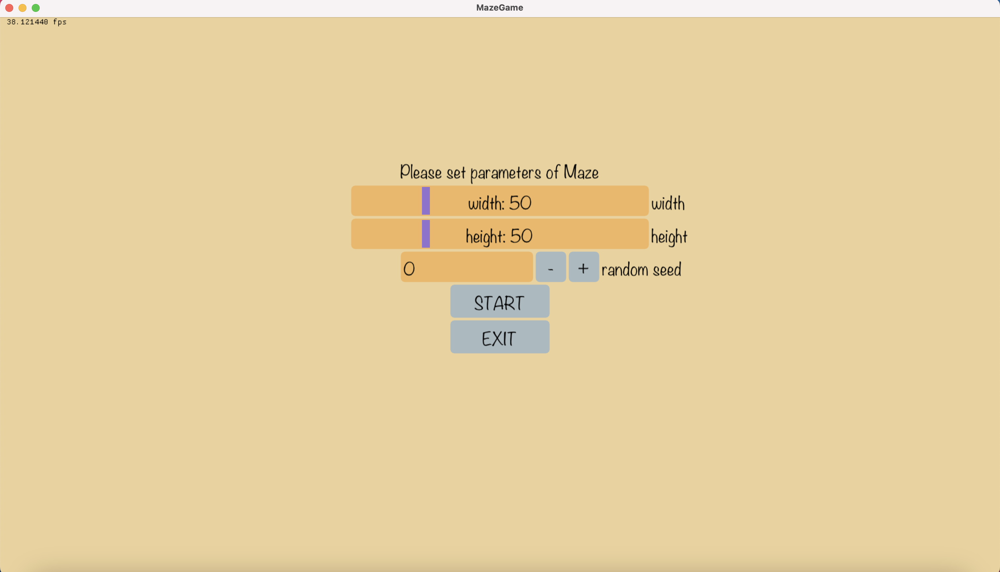
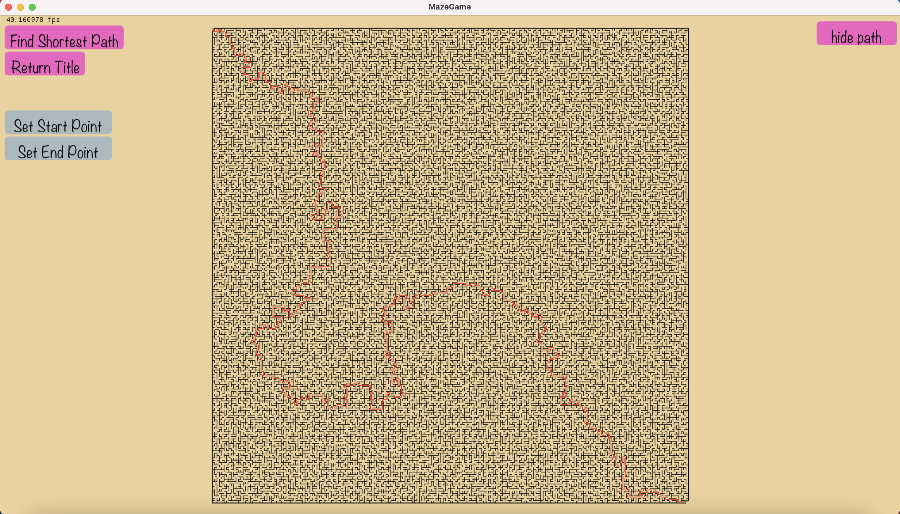
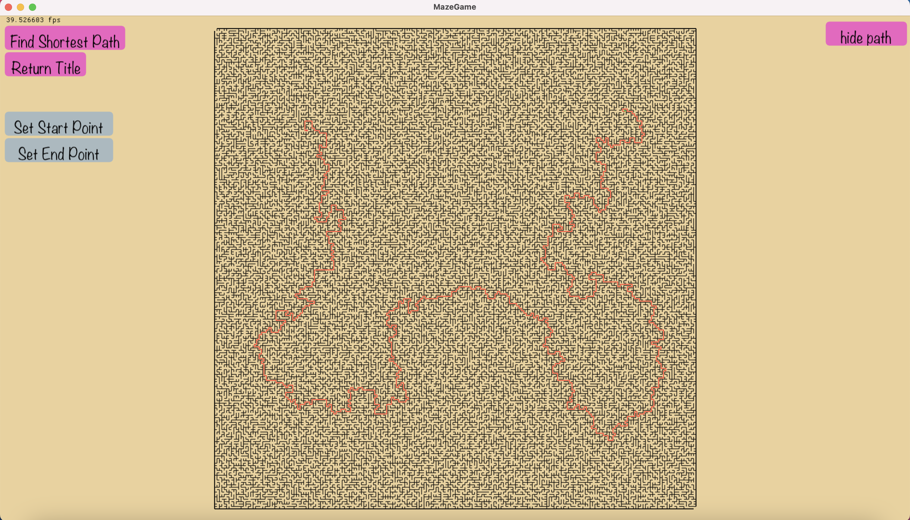

MazeGame
=======

Randomly generate path-connected maze. Path-connected maze means there is
at least one path connects any two positions in maze.

Use gui lib Dear-Imgui with SDL2+openGL as backend.

screen shot

